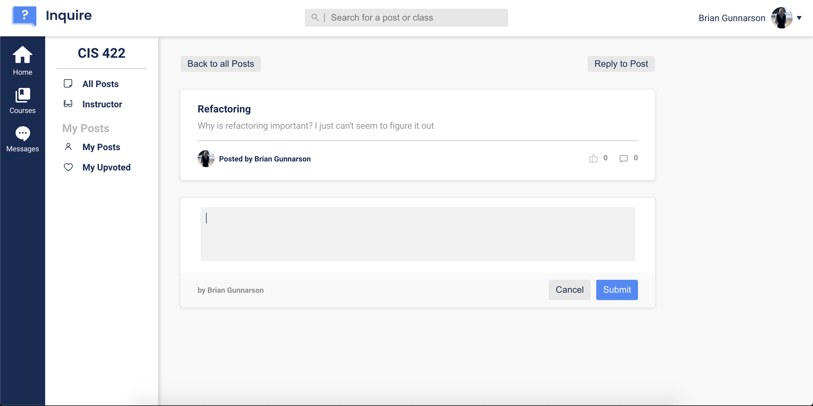
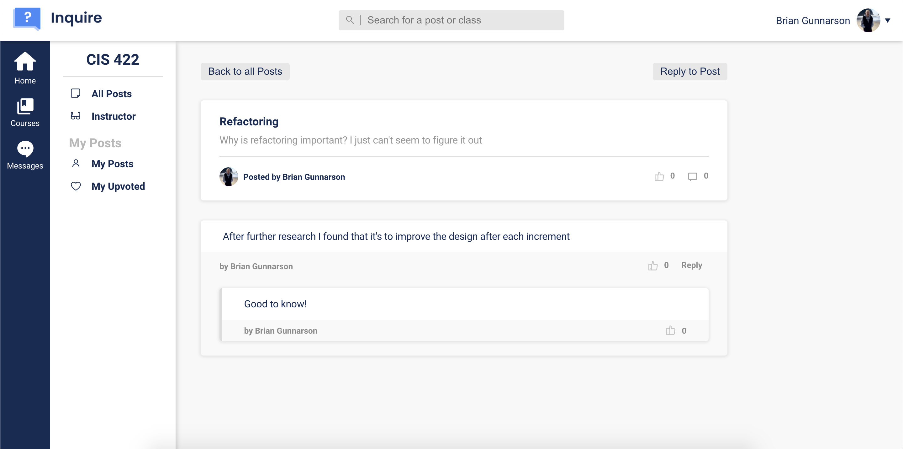

# Comments

This folder contains three files pertaining to creating and displaying comments and replies on posts.

## String of Events

There is a string of events that happens here:

1. The user will start in the _CommentView.js_ file since that is where new comments are drafted and displayed
2. Once they submit a comment, they will be moved to the _Comment.js_ file for the actual comment to be put together with everything the user has provided
3. While building the comment inside the _Comment.js_ file the user will then be redirected to the _CommentReply.js_ file to attach all of the replies associated with a comment to the comment itself
4. Once everything is put together it's all displayed in CommentView.js

## User's POV

Figure 1

 

In Figure 1 we see step 1 of the list above where the user is creating a draft.
 
 

Figure 2

 

In Figure 2 we see the results of steps 2 and 3 being displayed. Since we're seeing what's being displayed that means we're currently on step 4 and will be until another comment is drafted or we leave this specific post.
